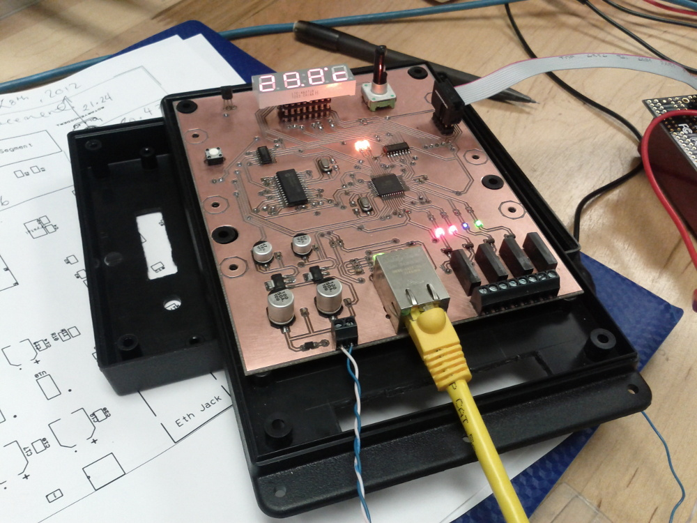
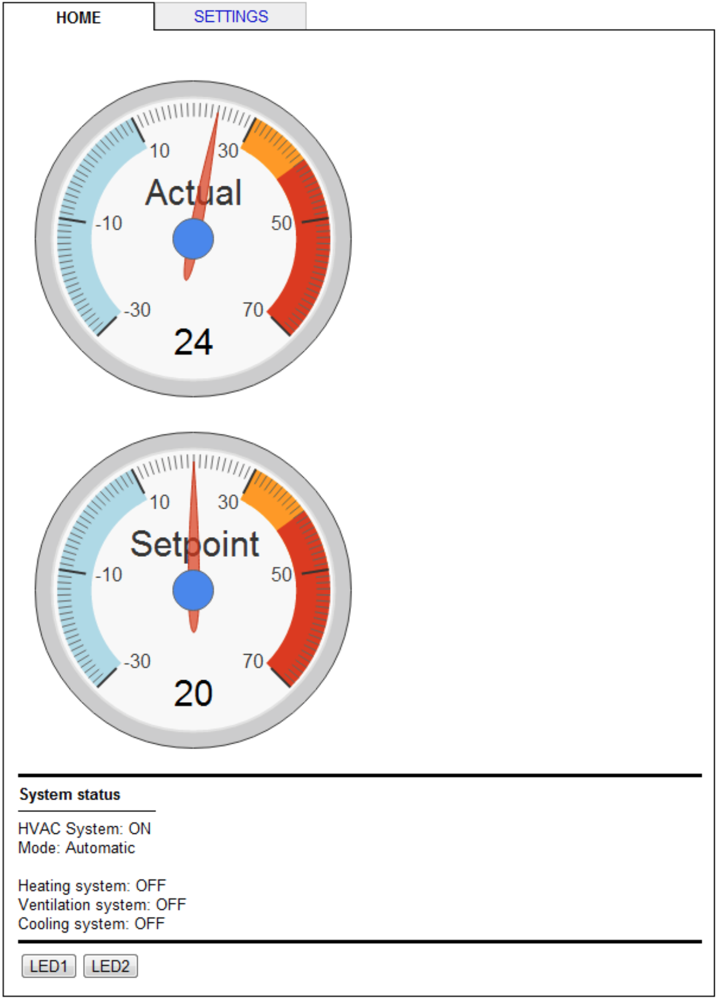
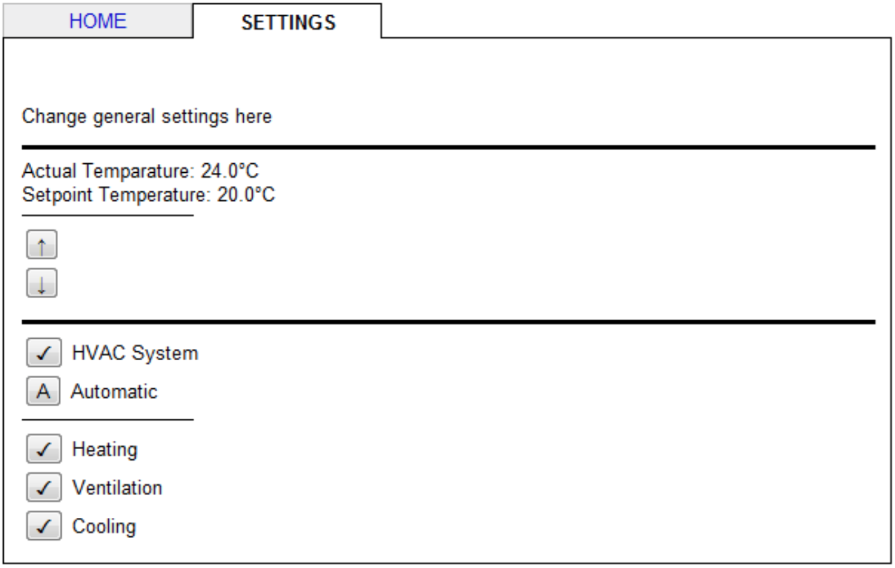

# internet-thermostat

## about

This is a final year project for the Electronics Engineering Technology program at Dawson College in Montreal, Qc.

## components

It is based on the following components:
- ATmega32 8-bit microcontroller
- ENC28J60 Ethernet controller
- AD22100S Temperature sensor
- EN12 Rotary encoder
- LTC-4727JR 4 digit 7 segment display

## building and installing

To build the firmware image:

    $ make

To erase flash on mcu:

    $ make uninstall

To install firmware using jtag on avrdragon with avrdude:

    $ make install

To delete generated files:

    $ make clean

## credits

The TCP, IP, HTTP, Ethernet, ICMP, ARP and ENC28J60 code is based on AVRNETv1.0 by [Jirawat Kongkaen](http://avrportal.com/)
